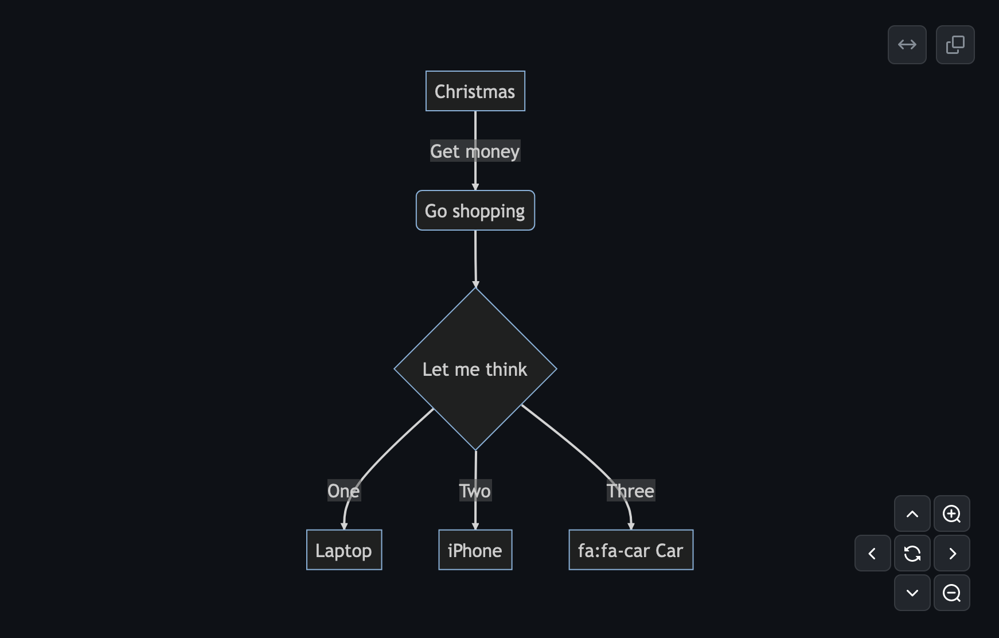

# svg-pan-zoom

Basic idea is to add pan and zoom to SVG. For example like in Google maps or GitHub:

## UX

### Interaction

| intention | keyboard                   | mouse            | trackpad                | touchscren          |
| --------- | -------------------------- | ---------------- | ----------------------- | ------------------- |
| scrool    | <kbd>↑</kbd>, <kbd>↓</kbd> | (3) wheel        | (5) two finger drag     | (6) one finger drag |
| pan       | (1)                        | left clik + move | one finger click + move | two finger drag     |
| zoom      | (2)                        | (4)              | pinch                   | pinch               |

Options:

- 1, 2, 4 - we can add buttons (like in GiiHub screenshot above)
- 1 - focus + <kbd>↑</kbd>, <kbd>↓</kbd>, <kbd>←</kbd>, <kbd>→</kbd>
- 2 - focus + <kbd>+</kbd>, <kbd>-</kbd>
- 4 - right click + move

Notes:

- 3, 5 - I don't want to use wheel (mouse) or two finger drag (trackpad) for zoom to avoid problem woth scroll trap.
- 6 - I don't want to use one finger drag (touchscreen) for pan. Instead, when people would use one finger drag over SVG, it would show overlay which instructs people to use two fingers

### Features

- core
  - programmatic zoom, pan
  - interaction for zoom (without buttons)
  - interaction for pan (without buttons)
  - overlay (see above point 6)
- UI (buttons)
  - zoom
  - pan
  - reset
  - full-screen
- other
  - max, min zoom
  - fit, resize, crop, center
- fancy
  - minimap
  - zoom to object

## Implementation

### Transformation

- [svg `viewBox`](https://css-tricks.com/creating-a-panning-effect-for-svg/)
- [root element `transform`](https://www.petercollingridge.co.uk/tutorials/svg/interactive/pan-and-zoom/)
- [`position: relative` and `CSS transform`](https://stackblitz.com/edit/multi-touch-trackpad-gesture?file=index.js)
  - see also [use-gesture example](https://codesandbox.io/p/sandbox/github/pmndrs/use-gesture/tree/main/demo/src/sandboxes/card-zoom?file=%2Fsrc%2FApp.tsx%3A22%2C10-22%2C15)

### Other

- [Detect touchpad vs mouse in Javascript](https://stackoverflow.com/a/62415754)
- [Affine matrix](https://upload.wikimedia.org/wikipedia/commons/2/2c/2D_affine_transformation_matrix.svg)

## Alternatives

There are a lot of solutions for this problem:

- https://github.com/bumbu/svg-pan-zoom
- https://jillix.github.io/svg.pan-zoom.js/
- https://github.com/anvaka/panzoom
- https://www.npmjs.com/package/svg-pan-zoom-container
- https://svgjs.dev/docs/3.0/plugins/svg-panzoom-js/
- https://www.npmjs.com/package/react-svg-pan-zoom
- https://timmywil.com/panzoom/
- https://www.jqueryscript.net/other/SVG-Pan-Zoom-jQuery-SVGPanZoom.html
- https://www.d3indepth.com/zoom-and-pan/
- https://www.npmjs.com/package/react-zoom-pan-pinch
